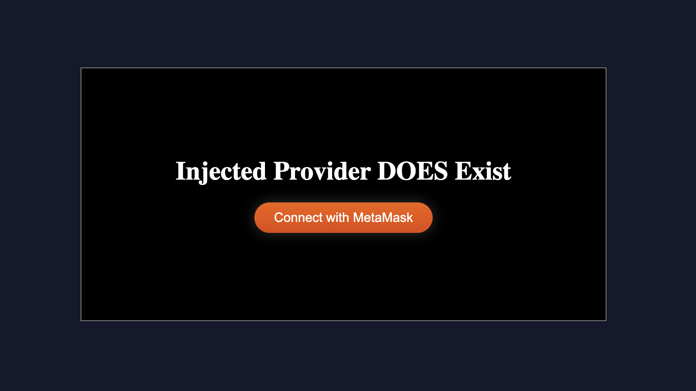
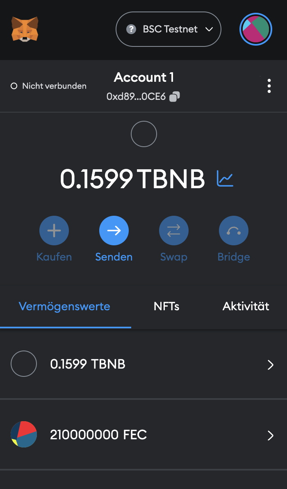

# 📦 Generator Web3 Dapp


[](https://www.npmjs.com/package/generator-web3-dapp)
[](https://www.npmjs.com/package/generator-web3-dapp)
[](https://github.com/prod3v3loper/generator-web3-dapp/releases)

[](https://github.com/prod3v3loper/generator-web3-dapp/commits/main)
[](https://github.com/prod3v3loper/generator-web3-dapp/blob/main/LICENSE)
[](https://github.com/prod3v3loper/generator-web3-dapp/issues)


<div style="text-align:center; display: block;">


<h1>DEVELOPING with BLOCKCHAIN</h1>

This scaffold creates in seconds for you a professional environment to develop with 

`Web3` `Contracts` & `dApps`

## MetaMask button ready template on start



## Deploy your coin ready



</div>

# OVERVIEW

Create solidity contracts and call it with web3.

## CONTRACTS

You have here two workdirs, first the created project `root dir` after install. Also in the created folder with the scaffold. And in the `frontend dir` you can use `npm`.

In the root dir you can use the `truffle` and `npm` commands.

In the frontend dir you can use `npm`, `npx` (Webpack executes), `tsc` (TypeScript executes).

## FRONTEND

Frontend packages, code a application in HTML (5), SASS (CSS), TS (X) and JS (X).

- [Webpack](https://webpack.js.org/) (Bundler)
- [TypeScript](https://github.com/Microsoft/TypeScript) (Code in ES6 or higher)
- [Preact](https://github.com/developit/preact) (TSX and JSX)
- [Redux-Zero](https://github.com/redux-zero/redux-zero) (Storage)
- [Babel](https://github.com/babel/babel) (Compile back for Browserslist to last 2 versions or other options)

More information about the frontend: [generator-webpack-preact](https://www.npmjs.com/package/generator-webpack-preact).

# INSTALL

1. Install [Node.js](https://nodejs.org/en/) to use the NPM (Node Package Manager), if not installed.
  - Additional you can install NVM (Node Version Manager) https://github.com/nvm-sh/nvm to change version.
2. You can use `yo` (Yeoman) to install the scaffold and start with it.
  - Also install yeoman global `npm install -g yo`.

> LOCAL

Switch to your projects folder.

```bash
username$ cd /Users/username/projects/
```

```bash
projects$ npm i generator-web3-dapp
```

```bash
projects$ yo
```

If promt a call

```bash
? 'Allo prod3v3loper,! What would you like to do? (Use arrow keys)
  Run a generator
> Web3 Dapp
```

or directly

```bash
projects$ yo web3-dapp
```

Enter and create your project

> GLOBAL

To use it from everywhere install the generator global.

```bash
projects$ sudo npm i -g generator-web3-dapp
```

Type password and now run in everywhere in your project folders, no local install need anymore.

```bash
projects$ yo
```

If promt a call

```bash
? 'Allo prod3v3loper,! What would you like to do? (Use arrow keys)
  Run a generator
> Web3 Dapp
```

or directly

```bash
projects$ yo web3-dapp
```

Enter and create your project.

# Promt for the solution

And we become a promt ;).

```bash
? Customer name? (customer)
? Project year? (2019)
? Project name? (newsletter)
? Components you want to use? (type comma seperated) (counter)
? Want you install all dependencies? Y/n
```

After answer all questions start the create.

```bash
   create contracts/MYCOIN.sol
   create migrations/1_deploy_contracts.js
   create test/my_coin.js
   create src/index.tsx
   create src/scss/style.scss
   create public/index.html
   create package.json
   create global.config.json
   create tsconfig.json
   create webpack.config.js
   create webpack.dev.js
   create webpack.pro.js
   create src/components/counter/actions.js
   create src/components/counter/counter.js
   create src/components/counter/store.js
```

# What this do

The following structure is created after the prompt input. With the typed data.

```
Projects
|
├── customer/ (prompt: project name)
|   └── year/ (prompt: 2019)
|       └── project/ (prompt: newsletter)
|           └── contracts/
|           |   └── MYCOIN.sol
|           └── frontend/
|           |   └── components/
|           |   |   └── counter/
|           |   |       └── actions.js
|           |   |       └── counter.js
|           |   |       └── store.js
|           |   └── public/
|           |   |   └── index.html
|           |   └── src/
|           |       └── index.jsx
|           |       └── scss/
|           |           └── style.scss
|           └── migration/
|               └── 1_deploy_contracts.js
```

But the idea behind it is to collect and manage all our contracts and dapps in our projects folder. So every time we call the generator in our projects folder and create a new project with customer name, it will be added to the others.

```
Projects
|
├── customer/ (prompt: project name)
|   └── year/ (prompt: 2019)
|       └── project/ (prompt: newsletter)
|           └── contracts/
|           |   └── MYCOIN.sol
|           └── frontend/
|           |   └── components/
|           |   |   └── counter/
|           |   |       └── actions.js
|           |   |       └── counter.js
|           |   |       └── store.js
|           |   └── public/
|           |   |   └── index.html
|           |   └── src/
|           |       └── index.jsx
|           |       └── scss/
|           |           └── style.scss
|           └── migration/
|               └── 1_deploy_contracts.js
|
├── another-customer/
|   └── 2018/
|   |   └── project1/
|   |   |   └── ...
|   |   └── project2/
|           └── contracts/
|           |   └── MYCOIN.sol
|           └── frontend/
|           |   └── components/
|           |   |   └── counter/
|           |   |       └── actions.js
|           |   |       └── counter.js
|           |   |       └── store.js
|           |   └── public/
|           |   |   └── index.html
|           |   └── src/
|           |       └── index.jsx
|           |       └── scss/
|           |           └── style.scss
|           └── migration/
|               └── 1_deploy_contracts.js
|   └── 2019/
|       └── project1/
|       |   └── ...
|       └── project2/
|           └── contracts/
|           |   └── MYCOIN.sol
|           └── frontend/
|           |   └── components/
|           |   |   └── counter/
|           |   |       └── actions.js
|           |   |       └── counter.js
|           |   |       └── store.js
|           |   └── public/
|           |   |   └── index.html
|           |   └── src/
|           |       └── index.jsx
|           |       └── scss/
|           |           └── style.scss
|           └── migration/
|               └── 1_deploy_contracts.js

```

# USAGE

Now run and see the Magic :) This is only for the frontend.

> Frontend folder is only for frontend not for contracts, link below for contracts and solidity with truffle.

Switch to the new project folder we have created. (You typed in the prompt default as example **newsletter/frontend**).

```bash
projects$ cd /Users/username/projects/customer/year/newsletter/frontend
```

If you NOT installed dependencies in the prompts, then install first.

```bash
frontend$ npm install
```

This command start the Server with the hotmodule.

```bash
frontend$ npm run dev
```

```bash
> example@1.0.0 dev
> webpack serve --open --config webpack.dev.js

<w> [webpack-dev-server] "hot: true" automatically applies HMR plugin, you don't have to add it manually to your webpack configuration.
<i> [webpack-dev-server] Project is running at:
<i> [webpack-dev-server] Loopback: http://localhost:8080/
<i> [webpack-dev-server] On Your Network (IPv4): http://xxx.xxx.xxx.xx:8080/
<i> [webpack-dev-server] On Your Network (IPv6): http://[xxxx::x]:8080/
<i> [webpack-dev-server] Content not from webpack is served from '/Users/username/Sites/testing/example/2023/newsletter/frontend/public' directory
<i> [webpack-dev-middleware] wait until bundle finished: /
asset index.bundle.js 782 KiB [emitted] (name: index)
asset index.html 294 bytes [emitted]
```

This command build the dist folder with the end product.

```bash
frontend$ npm run prod
```

To close (stop the localhost server) the NPM run type in console (Terminal):
`Ctrl + C`.

Create contract, migration or test with truffle.

> Change to root in project if you in frontend folder.

```bash
projects$ cd /Users/username/projects/customer/year/newsletter/
```

```bash
newsletter$ truffle create contract YourNewCoin
```

```bash
newsletter$ truffle create migration YourNewCoin
```

```bash
newsletter$ truffle create test YourNewCoin
```

Build contracts created contract.

```bash
newsletter$ truffle compile
```

```bash
Compiling your contracts...
===========================
> Compiling ./contracts/MYCOIN.sol
> Artifacts written to /Users/username/Sites/testing/example/2023/newsletter/build/contracts
> Compiled successfully using:
   - solc: 0.8.13+commit.abaa5c0e.Emscripten.clang
```

Start developing with truffle

```bash
newsletter$ truffle develop
```

Look for more [here](https://github.com/prod3v3loper/generator-web3-dapp/blob/main/app/templates/README.md).

# UNINSTALL

**NPM**

Local

```bash
projects$ npm uninstall generator-web3-dapp
```

Global

```bash
projects$ npm uninstall -g generator-web3-dapp
```

# PACKAGE

You find `generator-web3-dapp` in [Yeoman generator](https://yeoman.io/generators/), [NPM](https://www.npmjs.com/) and on [Github](https://github.com/).

[NPM - generator-web3-dapp](https://www.npmjs.com/package/generator-web3-dapp)

[GitHub - generator-web3-dapp](https://github.com/prod3v3loper/generator-web3-dapp)

[Github Theme - generator-web3-dapp](https://prod3v3loper.github.io/generator-web3-dapp/)

# ToDos

- [ ] Routing

# Contribute

Please read the [contributing](https://github.com/prod3v3loper/generator-web3-dapp/blob/main/CONTRIBUTING.md).

# Authors

**[Samet Tarim](https://www.prod3v3loper.com)** - _All works_

# Support

[Hyperly](https://www.hyperly.de)

# License

[MIT](https://github.com/prod3v3loper/generator-web3-dapp/blob/main/LICENSE) - [prod3v3loper](https://www.tnado.com/author/prod3v3loper/)
